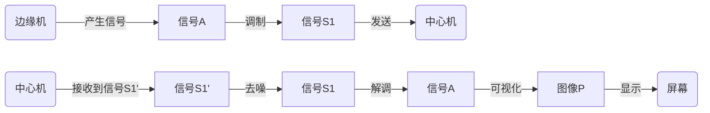

## 立项报告——电波绘影

[TOC]

### 一、工程架构

#### 1.基本信息

电波绘影，一个基于**中心处理**的信号可视化链路系统。

工程小组成员是来自2023级信息工程（创新班）的**孙艺、李昊峻、马梓豪**。

#### 2.核心架构
构建三级处理链路系统：

**边缘机**负责接收外部/产生信号，并调制发送到中心机。

**中心机**负责接收信号并将其可视化，并显示出来。

#### 3.信号流

### 二、关键技术点

| 技术点       | 实现要点             | 相关库     |
| ------------ | -------------------- | ---------- |
| 1.信号去噪   | 可选添加高斯噪声模拟 | NumPy      |
| 2.调制解调   | BTFK调制             | SciPy      |
| 3.数模转换   | 二进制文件读写       | Python IO  |
| 4.信号可视化 | （进阶）动态频谱生成 | Matplotlib |

### 三、小组成员组成与分工

**孙艺**：工程设计、信号文件的写入读取、多文件链路构建

**李昊峻**：信号的BTFK调制与解调

**马梓豪**：简单频谱图生成与显示

### 四、具体实践

**实践采用纯软件方案，不脱离一台电脑。**

#### 1.信号传递链路

难以模拟两个机器的传递，将在电脑内通过**写入和读取同一个文件**来完成。

**信号文件使用.bin形式，图片形式采用.png形式**。

1. 边缘A输出tx_audio.bin
2. 中心机输出rx_image.bmp

#### 2.调制解调

技术核心之一，编写代码完成。

主要使用**scipy.signal等库**。

#### 3.去噪模块

由于直接读取文件并不会产生噪声，暂定的想法是**人为添加高斯白噪声**。

不过由于此内容非项目核心内容，加之工程体量和团队能力的原因，**可能略去这一部分**。

#### 4.信号可视化

技术核心之一，编写代码完成。主要使用**matplotlib、opencv等库**

大体为一个**频谱图表**，横轴频率，纵轴强度。这图片事实上使用**matplotlib、Opencv等库**可直接生成，但是我们不妨使其更有趣一些。

比如进行扫频，一定频段的信息结合起来为一个**柱形**，柱形面积为其强度。

比如给不同的柱子或者曲线段添加**颜色**，高强度用红色，低强度用蓝紫色，使得强度的对比变化更明显。

再比如添加别的元素。

### 五、应用性

1. **中心计算**：利用中心处理器的高算力和可编程性，完成多种可能的复杂的图像可视化，同时降低了边缘机的要求。
2. **文件模拟传输**：读写文件显示信号传输链路
3. **动态色温**：增强频谱图表现力

### 六、计划路线

#### 1.基础任务

1. 信号的BTFK调制与解调
2. 信号文件的保存读取
3. 简单频谱图生成与显示
4. 整合代码工程到链路系统中

#### 2.进阶任务

1. 实时生成显示图像
2. 频谱图颜色等美化
3. 噪声模拟产生与去噪
4. 声音导入处理

