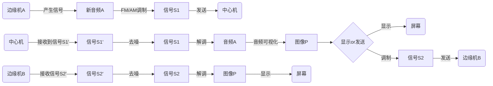

# 声波绘影——音频可视化链路系统
以下内容来自可行性报告，有删改。（最后一次修改4.15）

### 一、系统架构

主要内容是一个基于**中心处理**的音频可视化链路系统。

#### 1.核心架构

构建三级处理链路系统：

**边缘机a**负责接收外部/产生音频信号，并调制发送到中心机。

**边缘机b**负责接收并解调图像信号，并显示出来。

**中心机**负责接收信号并将其可视化，然后发送出去。

#### 2.详细信号流

### 二、关键技术点

| 技术点       | 实现要点                     | （可能）相关库 |
| ------------ | ---------------------------- | -------------- |
| 1.信号去噪   | 可选添加高斯噪声模拟         | NumPy          |
| 2.调制解调   | AM基础，FM进阶               | SciPy          |
| 3.数模转换   | 二进制文件读写               | Python IO      |
| 4.图像处理   | 位图编解码实现图像->数字信号 | OpenCV         |
| 5.音频可视化 | （进阶）动态频谱生成         | Matplotlib     |

### 三、具体实践

**实践采用纯软件方案，不脱离一台电脑。**

#### 1.音频发生

非项目核心内容，直接使用现成**.wav音频文件**。

#### 2.信号传递

难以模拟两个机器的传递，将在电脑内通过**写入和读取同一个文件**来完成。

**音频文件使用.wav文件形式，信号文件使用.bin形式，图片形式采用.bmp形式**。

1. 边缘A输出tx_audio.bin
2. 中心机输出rx_image.bmp

#### 3.音频调制解调

技术核心之一，编写代码完成。

主要使用**scipy.signal等库**。

#### 4.图像信号处理

技术核心之一，但**不确定是否能完成**，若无法完成可能跳过此部分。

先将图像转换为数字信号，然后将其转化为模拟信号，再将其调制发出。解调后转化为数字信号，然后我就不知道该怎么办了。

#### 5.去噪模块

由于直接读取文件并不会产生噪声，暂定的想法是**人为添加高斯白噪声**。

不过由于此内容非项目核心内容，加之工程体量和团队能力的原因，**可能略去这一部分**。

#### 6.音频可视化

技术核心之一，编写代码完成。主要使用**matplotlib、opencv等库**

不过由于进行复杂的音频可视化比较困难，目前仅有两个可能的想法。

##### 想法一：标准音频频谱图

大体为一个**频谱图表**，横轴频率，纵轴强度。这图片事实上使用**matplotlib、Opencv等库**可直接生成，但是我们不妨使其更有趣一些。

比如进行扫频，一定频段的信息结合起来为一个**柱形**，柱形面积为其强度。

比如给不同的柱子或者曲线段添加**颜色**，高强度用红色，低强度用蓝紫色，使得强度的对比变化更明显。

再比如添加别的元素。

##### 想法二：圆形音频频谱图

与前者类似，但是使用极坐标变换弯曲x轴（f轴）使整个图像大致呈现圆形。传递信息更不明确但美观性可能有提升。

##### 想法总结

| 方案 | 实现方式         | 效果         |
| ---- | ---------------- | ------------ |
| 标准 | plt、cv2等库实现 | 线性频域呈现 |
| 圆形 | 极坐标变换实现   | 圆形呈现     |

### 四、应用性

1. **中心计算**：利用中心处理器的高算力和可编程性，完成多种可能的复杂的图像可视化，同时降低了边缘机的要求。
2. **文件模拟传输**：读写文件显示信号传输链路
3. **动态色温**：增强频谱图表现力

### 五、计划路线

#### 1.基础任务

1. 音频的AM调制与解调
2. 信号文件的保存读取
3. 简单频谱图生成与显示
4. 整合工程（2）

#### 2.进阶任务

1. 图像转化为数字信号再转为模拟信号
2. 实时生成显示图像
3. 频谱图颜色等美化
4. 噪声模拟产生与去噪

#### 3.挑战任务

1. 圆形频谱图
2. 音频的FM调制与解调

### 终、内容来源

by 踹开那扇门

来自华南理工大学电子与信息学院2023级
